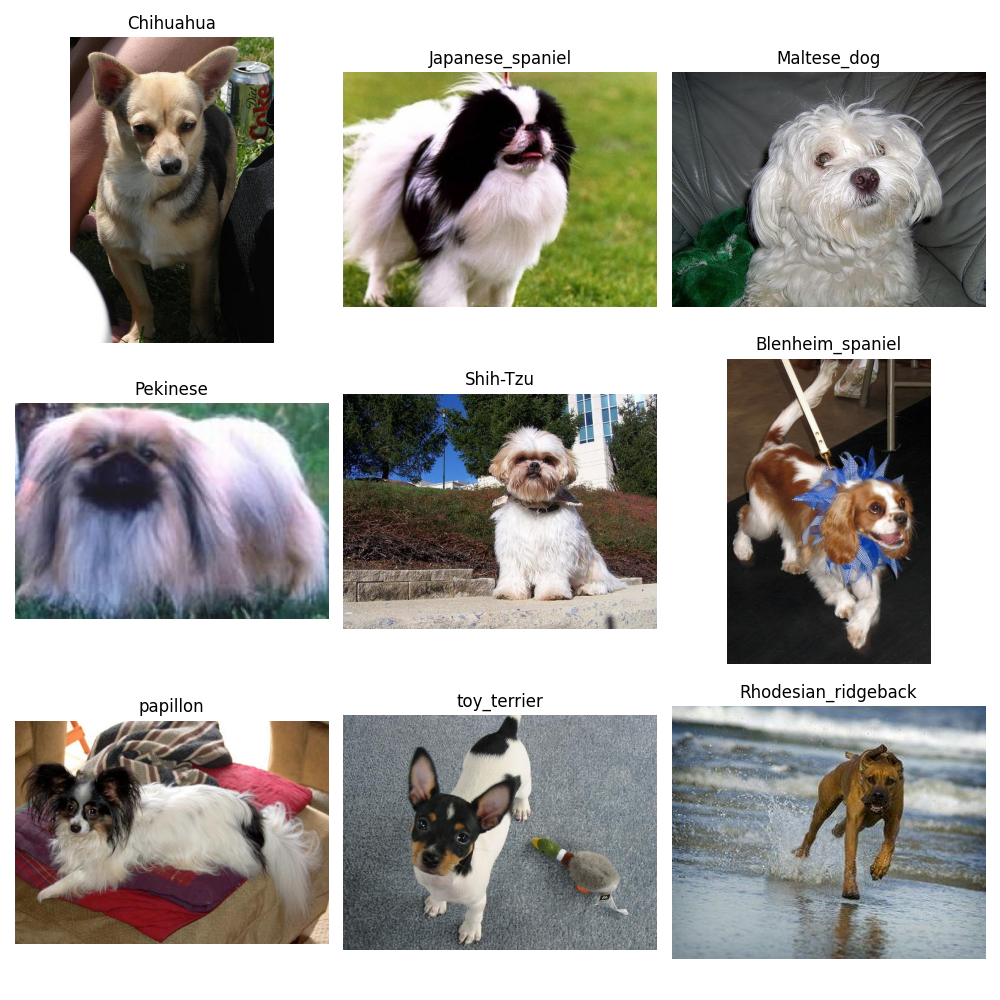
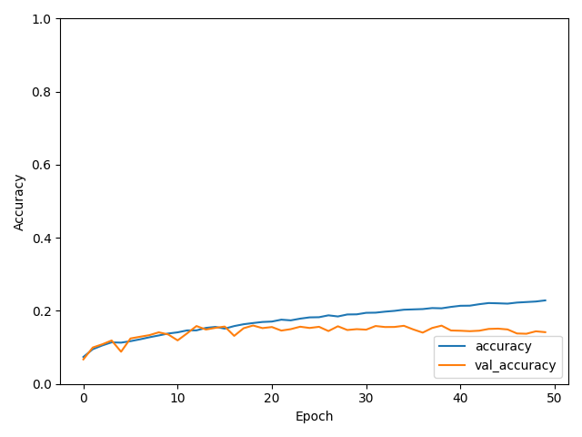
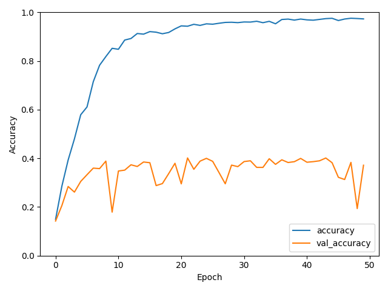

# ML_Project
Project task, Machine learning course at NTNU

## Data
The data used in this project is the "StandfordDogDataset" downloaded from Kaggle.
The dataset can be found [here](https://www.kaggle.com/jessicali9530/stanford-dogs-dataset).
1. Download the zip file of data from the link above. This should result in a `archive.zip` file with the data.
2. Create a new directory `data` inside the `model` root directory.
3. Inside the newly created `data` directory, create a new directory named `StanfordDogs`
4. Copy the zip file of the downloaded dataset to the `StanfordDogs` directory.
5. Unzip the file. This should result in either a new directory named `archive`, or two folders named `annotations` and `images`.
6. When the data is downloaded, the config file need to be changes to link to the data. This is explained in the `CONFIG` section. 

When the data is augmented it creates a new foler named `processed_data` in this data directory.

The data downloaded contains two types of data. A image file, and a related info file. The info file contains information like the name of the dog breed, but also coordinates for a bound box.
This bound box is the coordinates of an area of the image containing only the dog, filtering out other information. To use this or not can be adjusted in the configuration, described in the `Config` section below.

### Dowloaded data
Her we se an example of 9 images (1 from 9 different classes) of the original data.

### Augmented data
The data is augmented and stored to disk using the code from the `dataProcessing.py` file.
This can be done in the main function using the method `process_data`. This method creates a new directory `processed_data` inside the `data` directory. If for some reason you would want to augment the data again like when using a new amount of classes, the `process_data` directory and its contents needs to be deletede so that the augmentation can be done again. If this is not done, the method will throw an error.

## Config
The configuration of the application is done through the use of the `CONFIG` file under the `model` root directory.
Then values to configure is explained here:
- `GIVEN_CLASSES`: A list can be used to list a set of dog breeds for use in the data models. This is an extra feature, and does not need to be taken into consideration when configuring.
- `CLASS_COUNT`: The number `n` of dog breeds (classes) used in the model. This selects the `n` first classes sorted by name (directory name, not breed name). The maximum amount allowed here is 120.
- `IMAGE_SIZE`: A tuple defining the hight and width of the images when processed.
- `TRAINING_SET_SIZE`: The size of the training set when splittin the data into traingin data and test data. The value is currently 0.9 (90%).
- `VALIDATION_SET_SIZE`: The size of the validation data set taken from the training data. The split is currently set at 0.2 (20%) of training data to become the validation dataset.
- `AUGMENT_DATA_NUMBER`: The number of images generated from the image augmentation process.
- `IMAGE_CROP`: A boolean value to spesify if the image should be croped to the values given in the annotation files. This is explained under the `data` section.

- `DATA_PATH`: The given path to the `data` directory containing the data
- `ANNOTATIONS_PATH`: The data path to the annotation data. Given that the data is extracted as above on windows, this could be left alone.
- `IMAGE_DATA_PATH`: The data path to the image data. Given that the data is extracted as above on windows, this could be left alone.

## Reproducability
The results of the project should be easily reporducable using the supplied python notebook `main.ipynb`.
Note that the results we ran were on an augmented dataset, and since the augmentation is random within some given bounds the results might varry to some degree.
The code is tested on 3 different augmented sets of data, and these gave the same results (with an error margin of a pew percentage points), so reproducting the results should not be a problem.

Using the MLP we achieved an accuracy of 14% on the test dataset. The graph produced for the training and validation datasets can be found below. Note that this is the values for a dataset of 40 classes, not all 120.

Using the CNN we achieved an accuracy of 41% on the test dataset. The graph produced for the training and validation datasets can be found below. Note that this is the values for a dataset of 40 classes, not all 120.

## Code

### Data processing
The data processing directory contains two files.
The first one "data_info" is used to list and read different information from the dataset used in this project.
This information includes, the amount of images, average images per class, minimum and maximum amount of images in the classes, and image visualization.

The next file is the "dataProcessing" file. This file is used to augment the dataset used, as well as split the dataset into training set, validation set, and test set.

### Models

### MLP
The code for the multilayer perceptron can be found in the "MLP.py" file under the "models" directory.
This code contains the creation of the model, as well as loading of the data using keras reading from directory and prefetching.
The model is ran with the "MLP" method.

### CNN
The code for the multilayer perceptron can be found in the "CNN.py" file under the "models" directory.
This code contains the creation of the model, as well as loading of the data using keras reading from directory and prefetching.
The model is ran with the "CNN" method.

## Tuning
Automatic tuning of the models can be done with the classes contained in the `tuning` directory under `models`.
The ``MLPHyperModel`` is used to tune the MLP model contained in it, and the ``CNNHyperModel`` is used to hyperparameter tune the ``CNN``.
